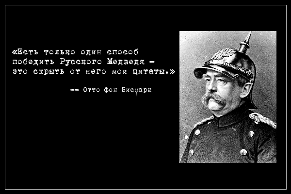

# quotegen - генератор цитат врагов России

## Предисловие

Одним из интересных феноменов современного "патриотического" дискурса
в России является практически детская вера в злобные намерения в
отношении своего государства со стороны различных исторических
деятелей. В частности, это выражается в том, что данным деятелям
приписывают разного рода цитаты, большинство из которых являются
совершенной выдумкой (и частенько придуманы в самой России различного
рода лицами, которым это выгодно). Данные цитаты во-первых, призваны
продемонстрировать их получателям людоедскую натуру вышеупомянутых
персонажей, а во-вторых, ещё больше насадить менталитет "осаждённой
крепости."

Особенной "любовью" у народа пользуются три персонажа:

* **Аллен Даллес** - с т.зр. россиян является автором ["Плана
    Даллеса."](https://ru.wikipedia.org/wiki/%D0%9F%D0%BB%D0%B0%D0%BD_%D0%94%D0%B0%D0%BB%D0%BB%D0%B5%D1%81%D0%B0)
    Это - самый зловещий и ненавидимый враг России.

* **Барак Обама** - самый русофобский президент за всю историю США.
    Печально известен тем, что регулярно мочится во всех подъездах страны.

* **Маргарет Тэтчер** - ей приписываются слова о том, что в России
    необходимо "оставить" 5 миллионов человек; остальные должны быть
    уничтожены.

* **Отто фон Бисмарк** - на самом деле, любим россиянами за то, что,
    будучи врагом России, оставил множество "цитат," в которых говорит
    о непобедимости русских. В отличие от остальных вышеупомянутых
    злодеев, за которыми закреплены весьма определённые цитаты,
    канцлеру периодически приписывают что-нибудь новенькое, призванное
    подтвердить правильность нынешнего курса.

## О программе

Программа запускается достаточно просто:

    ./quotegen "Владимир Путин принял Россию с флоппи дисками, а оставил с ПорнХабом."

Программа поставляется с несколькими preset'ами (`-p`):

* _bismarck_ (по умолчанию)
* _churchill_
* _dulles_
* _thatcher_

Помимо preset'ов, можно явно передать программе портрет деятеля (`-i`)
и/или его имя (`-s`).

## Требования

* Python 3.x
* PIL
